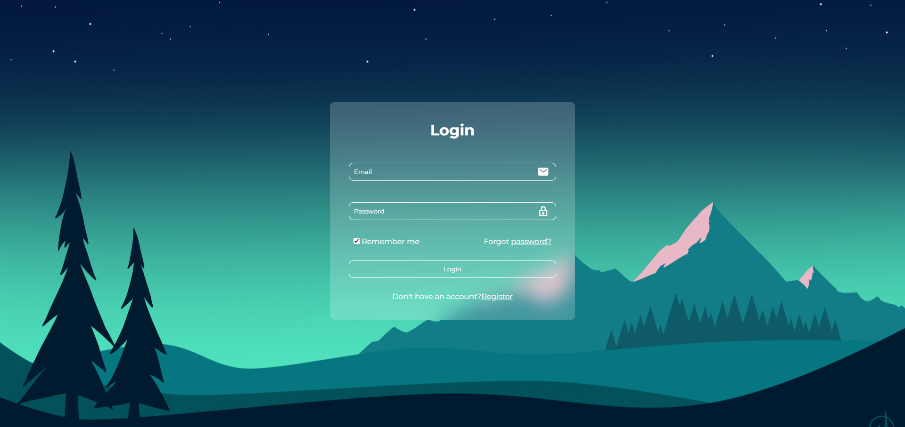

# SimpleLoginPage

A simple and clean login page created using HTML and CSS.

## Features

- Modern, visually appealing design
- Responsive layout
- Email and password input fields
- "Remember me" checkbox
- "Forgot password?" link
- "Register" link for new users

## Demo



## Installation

1. Clone the repository:
    ```bash
    git clone https://github.com/your-username/SimpleLoginPage.git
    ```
2. Navigate to the project directory:
    ```bash
    cd SimpleLoginPage
    ```
3. Open `index.html` in your web browser to view the login page.

## Usage

- Enter your email and password.
- Check the "Remember me" box if you want to stay logged in.
- Click on "Forgot password?" if you need to reset your password.
- Click on "Register" if you don't have an account yet.

## Contributing

Contributions are welcome! Please open an issue or submit a pull request for any improvements.

## License

This project is licensed under the MIT License.

## Contact

If you have any questions, feel free to contact me at [Musamaluleke65@gmail.com].


 
